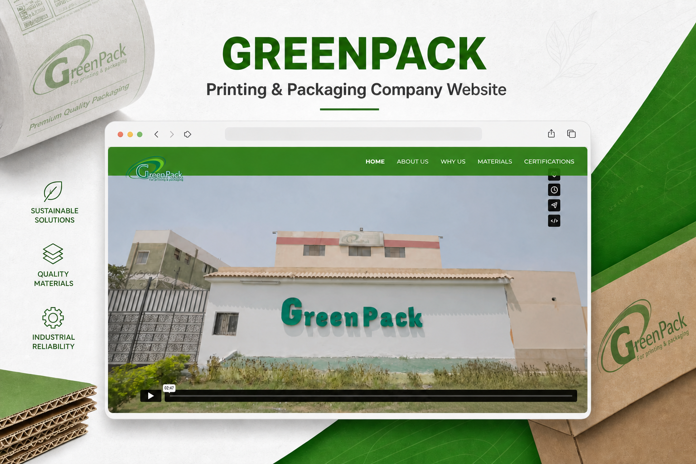
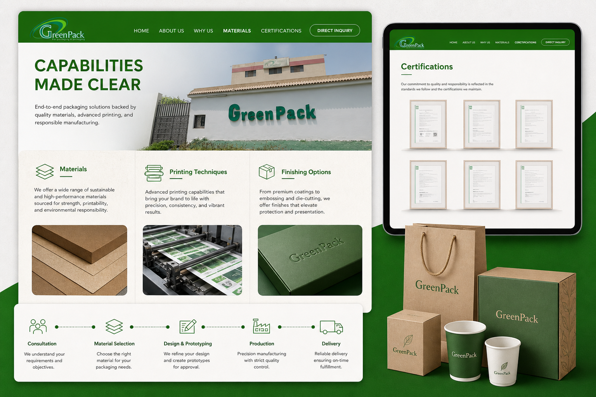
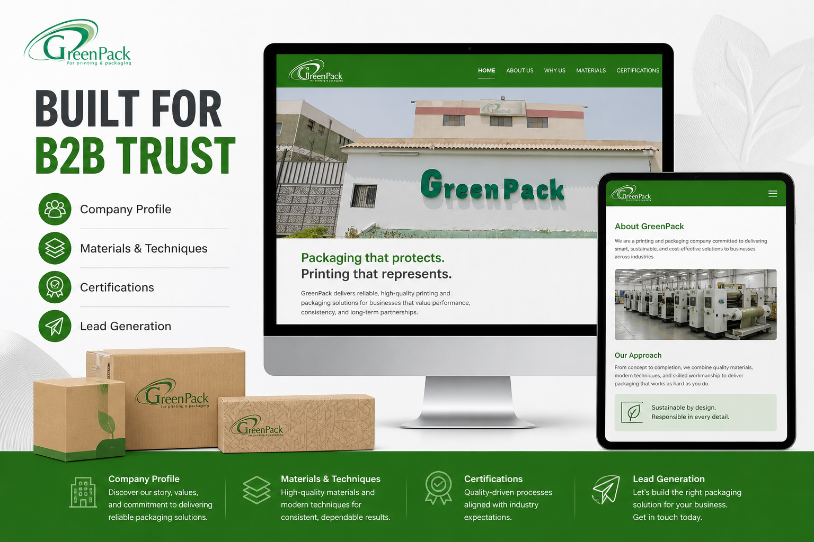
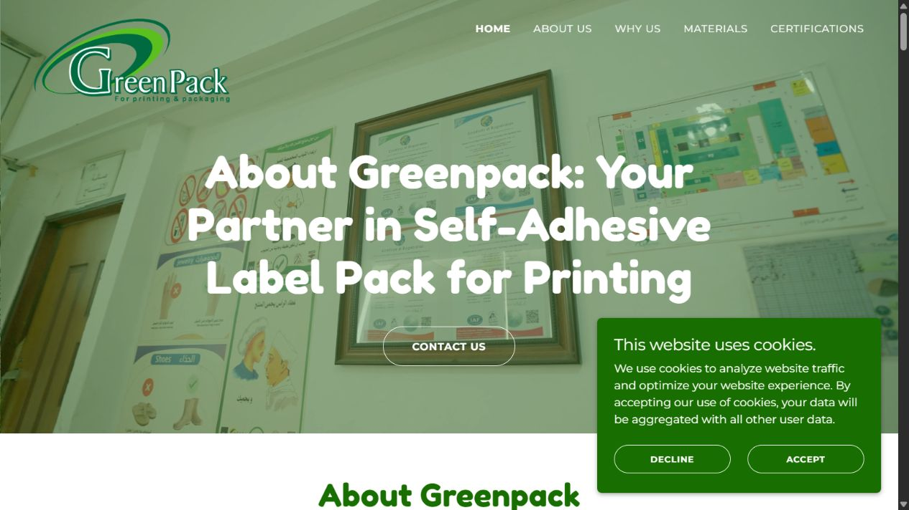

# GreenPack Printing & Packaging Corporate Website

> A responsive B2B website that transforms detailed manufacturing information into a credible, accessible sales and trust-building experience.

## Project overview

GreenPack needed a professional digital presence capable of explaining complex printing and packaging capabilities to business customers. The website organizes technical content into a clear journey that supports credibility, discovery and enquiries.

**My role:** Web Developer, Content Architect and QA Engineer  
**Delivery:** Requirements clarification, information architecture, implementation, content setup, testing and deployment

## Business capabilities presented

- Company mission, vision and competitive strengths
- Printing techniques, packaging materials and manufacturing capabilities
- Certifications and downloadable supporting content
- Partner, exhibition and company credibility sections
- Rich media and structured business content
- Direct contact paths supporting lead generation
- Responsive presentation for mobile, tablet and desktop audiences

## Manufacturing capabilities

## B2B trust and lead generation

## Production website

## Quality and delivery

- Content and navigation validation
- Responsive checks across major breakpoints
- Media, link and downloadable-file verification
- Usability review for business visitors
- Production deployment and launch validation

## Privacy and source code

This is a **public project case study**. The production source code, hosting credentials and private business material remain confidential. Company marks and brand assets belong to their respective owner.

## Need a corporate or industrial website?

I can handle the complete journey—from requirements and content organization through development, content upload, testing and deployment—so the client receives a professional website with minimal effort.
